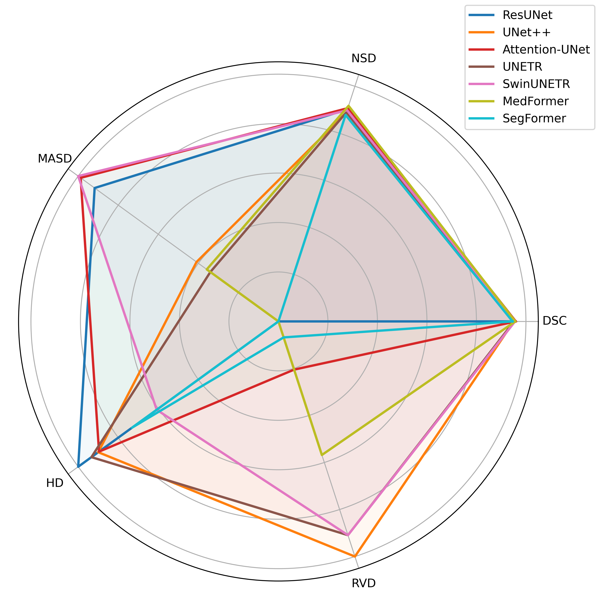

# Medical Liver Segmentation ToolKit

[](LICENSE)
[]()
[](https://www.python.org/)
[](https://github.com/marqinhos)


## Implemented Architectures

The following network architectures have been implemented:
- UNet
- VNet
- ResUNet
- UNet++
- Attention-UNet
- UNETR
- SwinUNETR
- MedFormer
- SegFormer


### Results



| Architectures     | DSC      | NSD      | MASD     | HD       | RVD      |
|------------------|----------|----------|----------|----------|----------|
| UNet             | 0.955    | 0.903    | 1.326    | 48       | -0.036   |
| VNet             | 0.941    | 0.860    | 3.483    | 148      | -0.052   |
| ResUNet          | 0.956    | 0.902    | 0.890    | **35**   | -0.046   |
| UNet++           | 0.951    | 0.888    | 1.218    | 37       | -0.009   |
| Attention-UNet   | **0.959**| 0.907    | 0.845    | 37       | -0.037   |
| UNETR            | 0.952    | 0.890    | 1.263    | 36       | **0.006**|
| **SwinUNETR**    | 0.956    | 0.898    | **0.837**| 43       | **-0.006**|
| MedFormer        | 0.957    | **0.917**| 1.251    | 55       | -0.021   |
| SegFormer        | 0.946    | 0.878    | 1.482    | 40       | -0.043   |


## Quickstart

> **⚠️ Warning**
> This project is under development

### Installation

> **💡 Software installation**
> Download Medical Liver Segmentation ToolKit

```bash
(.venv) $ git clone https://github.com/marqinhos/MedicalLiverSegmentationToolkit.git
```

```bash
(.venv) $ cd MedicalLiverSegmentationToolkit/
```

```bash
(.venv) $ pip install -r requirements.txt
```

### Usage

> **❗ Important**
> To introduce new network architectures, follow these steps:
>
> 1. Enter the architecture in `model/dim3/{your_architecture}.py`.
> 2. Add the network import in `model/utils.py`.
> 3. Add the network training configuration in `config/{database}/{your_architecture}_3d.yaml`.

##### Training Network

```bash
(.venv) $ python3 train.py --model {network_name} --max_epochs {num_max_epochs}
```

> **📝 Note**
> See the [Train Module](https://medicalliversegmentationtoolkit.readthedocs.io/en/latest/modules/train.html) documentation for more info on parameters.

> **💡 Tip**
> To train more than 1 network, use `train_sequential.py`, [more info](https://medicalliversegmentationtoolkit.readthedocs.io/en/latest/modules/train_sequential.html).

##### Test Network

```bash
(.venv) $ python3 train.py --model {network_name} --version {training_version}
```

##### Predict Network

```bash
(.venv) $ python3 train.py --model {network_name} --version {training_version}
```

> **💡 Tip**
> To predict more than 1 network, use `predict_sequential.py`, [more info](https://medicalliversegmentationtoolkit.readthedocs.io/en/latest/modules/predict_sequential.html).

### Evaluation of Trained Models

#### Performance Measures

> **📝 Note**
> The performance measures computed are:
>
> 1. Dice Similarity Coefficient (DSC).
> 2. Normalize Surface Distance (NSD).
> 3. Mean Average Surface Distance (MASD).
> 4. Hausdorff Distance (HD).
> 5. Relative Volume Difference (RVD).

```bash
(.venv) $ python3 metrics_sequential.py 
```

> **📝 Note**
> Generate a JSON file with networks as shown below ([more info](https://medicalliversegmentationtoolkit.readthedocs.io/en/latest/modules/metrics_sequential.html)):
> ```python
> :lineno-start: 20
> :emphasize-lines: 10
> 
> models_3d = [
>     'attention_unet',
>     'medformer', 
>     'resunet', 
>     'swin_unetr', 
>     'unet++', 
>     'unetr', 
>     'vnet', 
>     'segformer',
>     '{name_architecture}',
> ]
> ```

#### Complexity Measures

```bash
(.venv) $ python3 calculate_features_networks.py 
```

> **📝 Note**
> The profiler calculates:
>
> 1. Number of params.
> 2. Floating point operations per second (Flops).
> 3. Memory usage in an inference.
> 4. Layer sizes.
>
> [more info](https://medicalliversegmentationtoolkit.readthedocs.io/en/latest/modules/calculate_features_networks.html).

## License
**Medical Liver Segmentation ToolKit** is available under next license:

* AGPL-3.0 License: See [LICENSE](LICENSE) file for details.
## Author:
(c) 2024 ([Marcos Fernández](https://github.com/marqinhos))
