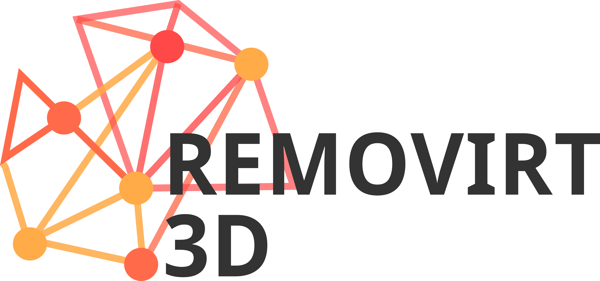

```{toctree}
:hidden:
src/quickstart.md
src/modules.rst
```
 
<div class="rectangle-feature" style="background-image: url('_static/fondo2.png')">
    <div class="intro-text">
        <h1>Medical Liver Segmentation ToolKit</h1>
    </div>  
    </div>

<div class="features">
    <div class="feature">
        <h3>Feature 1: Advanced Segmentation Algorithms</h3>
        <p2>Our toolkit includes state-of-the-art algorithms to ensure precise and accurate liver segmentation.</p2>
    </div>
    <div class="feature">
        <h3>Feature 2: Easy Integration</h3>
        <p2>Integrate easily with existing medical imaging workflows and pipelines.</p2>
    </div>
    <div class="feature">
        <h3>Feature 3: Evaluation measures</h3>
         <p2>Employs a variety of evaluation measures such as the Dice Similarity Coefficient, Mean Average Surface Distance or Relative Volume Difference to ensure the quality and precision of liver segmentation.</p2>
    </div>
    <div class="feature">
        <h3>Feature 4: Comprehensive Documentation</h3>
        <p2>Find detailed documentation and guides to help you get started quickly.</p2>
    </div>
</div>

<div class="footer">
    <div class="container">
        <p>Partners:</p>
        
        
        
    </div>
</div>

<div class="intro-text">
    <h2>Get Started</h2>
    <p>
        Dive into our comprehensive documentation and start using the Medical Liver Segmentation ToolKit today!
    </p>
</div>